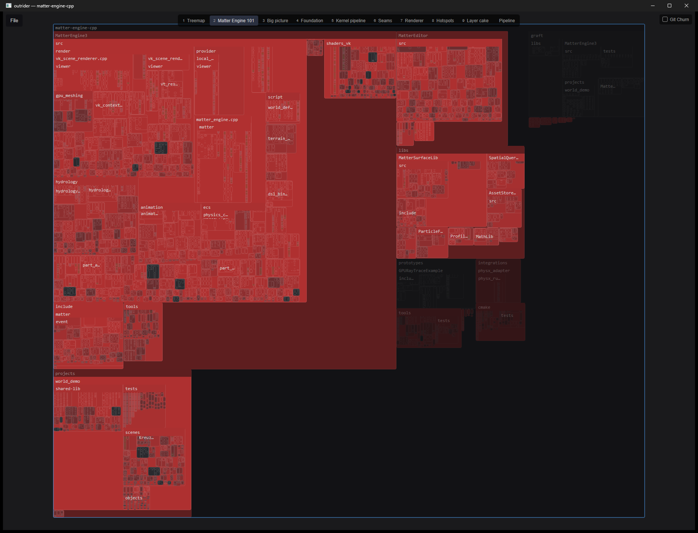
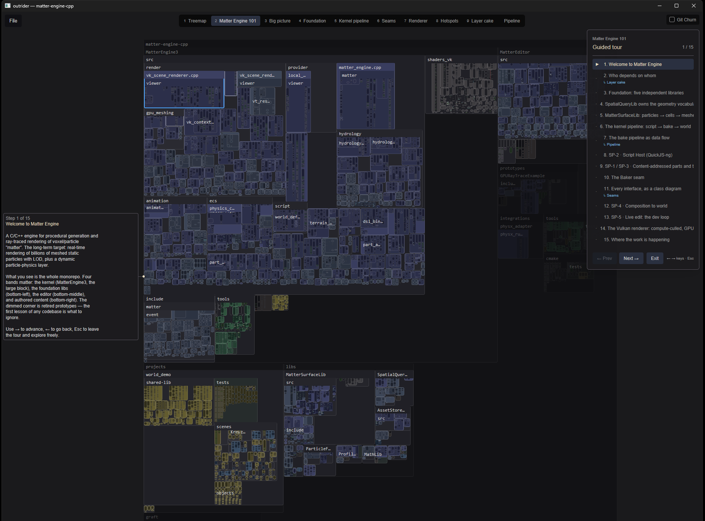
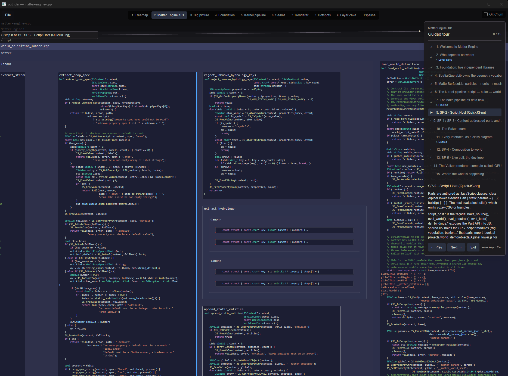
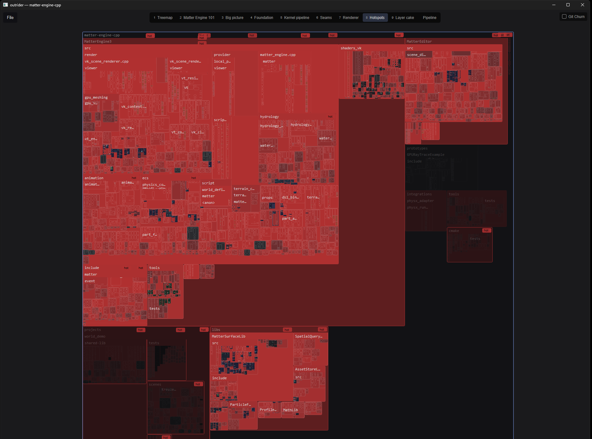
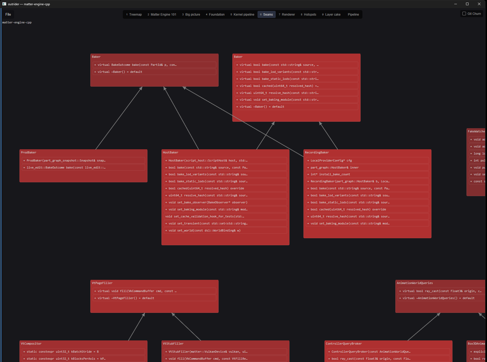

# Outrider

**See the code, not a summary of it.** Outrider renders an entire codebase as an
interactive treemap where every file and every symbol is a real, readable box of
source. Navigate it, search it, and watch what changes.

**Website: [electricjack.github.io/outrider-ide](https://electricjack.github.io/outrider-ide/)** ·
[Download for Windows](https://github.com/ElectricJack/outrider-ide/releases/latest/download/outrider.exe) ·
[All releases](https://github.com/ElectricJack/outrider-ide/releases)

[](https://electricjack.github.io/outrider-ide/)



## Why

Codebases are increasingly written and rewritten by AI agents, fast. The usual
way to understand one is to *ask the agent* — which means your only quick window
onto the code is an account given by the same model that wrote it. The author is
narrating its own homework.

Outrider is an instrument rendered from ground truth: the AST, the call graph,
the diff, and git history. The split is enforced throughout:

- **Structural signals assess.** Whether code is large, tangled, central, or
  churning is computed from the repo and inspectable down to the number.
  Structure owns every colour and every bit of geometry.
- **The LLM explains.** Narration is useful and always marked as the model's
  account. It never drives an assessment, a colour, or a heat value.

## Zoom is the interface

There is no "overview mode" separate from the code. One continuous zoom walks a
level-of-detail ladder — line bars, then miniature text, then live shaped glyphs
— so a box is never empty and never a meaningless rectangle. Zoom out to see
forty thousand files; zoom in and read the comment on a field declaration.



## Structure you can see

Git churn paints the map directly, so the parts of the repo under active change
are obvious before you have read a line.



The same symbols can be laid out by their relationships instead of their
containment — inheritance as a class diagram, call graphs, dependency layer
cakes, data-flow pipelines. Focus follows you between representations.



## Agents drive the view

Views are plain JSON files in `.outrider/views/`. An agent can write one — a set
of filters, colour layers, marks, and a camera path with narration anchored to
the symbols it describes — drop it in the folder, and the watcher opens it as a
tab. That turns "explain this codebase" into a guided tour through the real code
rather than a wall of prose.

The `outrider-cli` binary exposes the same surface for scripting: query symbols,
drive a tour, and read back the comments a human left while walking it.

## Features

- **Treemap layout** — the entire codebase at once, zoom in to read any of it
- **Semantic level of detail** — line bars → miniature text → live glyphs
- **Syntax highlighting** — Rust, Python, C/C++, JavaScript, TypeScript, TSX, C#, GLSL, HLSL
- **Git churn visualisation** — heat and hotspot marks from real commit history
- **Graph space** — inheritance, call graph, dependency and pipeline diagrams
- **View specs** — declarative JSON views, hot-reloaded from disk
- **Guided tours** — scripted camera paths with in-view narration
- **Fuzzy search** — files (Ctrl+P) or symbols (Ctrl+T)
- **Keyboard navigation** — spatial arrow-key movement through the map
- **Cross-platform** — Linux, macOS, Windows

## Build

Requires Rust 1.89+. The locked dependency graph cannot support Rust 1.80:
`cosmic-text` 0.19.0 and `smol_str` 0.3.6 both declare Rust 1.89 as their
minimum supported version. CI has a dedicated Rust 1.89 job to prevent the
project's effective minimum from drifting upward unnoticed.

```bash
cargo build --release
```

The binary is at `target/release/outrider`.

## Usage

```bash
# Open a folder picker
outrider

# Open a specific project
outrider /path/to/project
```

## Controls

| Key | Action |
|-----|--------|
| Arrow keys | Navigate between nodes |
| Enter | Zoom into selected node |
| Esc | Zoom out to parent |
| Ctrl+P | Search files |
| Ctrl+T | Search symbols |
| Ctrl+, | Open settings |
| Ctrl+Shift+E | Open in file manager |
| Alt+Left/Right | Navigation history |
| Home | Frame entire project |
| Scroll wheel | Zoom in/out |
| Click + drag | Pan |
| Right-click | Context menu |
| `c` | Comment on the selected symbol |

## Settings

Settings are stored in:
- Linux: `~/.config/outrider/settings.json`
- macOS: `~/Library/Application Support/outrider/settings.json`
- Windows: `%APPDATA%\outrider\settings.json`

You can configure which file extensions and folders are filtered out of the treemap.

### Cache behavior

- The in-memory texture cache limit is global across projects.
- The disk texture cache limit is configured per project and defaults to 1 GB for each project.
- Texture and Git churn caches live under the operating system's cache directory.
- Texture work prioritizes nodes currently visible in the viewport so useful project content appears sooner.
- Outrider never writes cache files into repositories that it analyzes.

## Prior art

Treemaps of source code have a long lineage, and Outrider is a recent entry in
it rather than a new idea: SeeSoft (Bell Labs, 1992), the Linux kernel treemap
(2002), Microsoft's Code Thumbnails (2006), Yoann Padioleau's
[codemap](https://github.com/aryx/codemap) with semantic sizing and colouring,
and Rik Arends' Makepad Studio code atlas. Worth your time if this interests you.

## License

MIT
